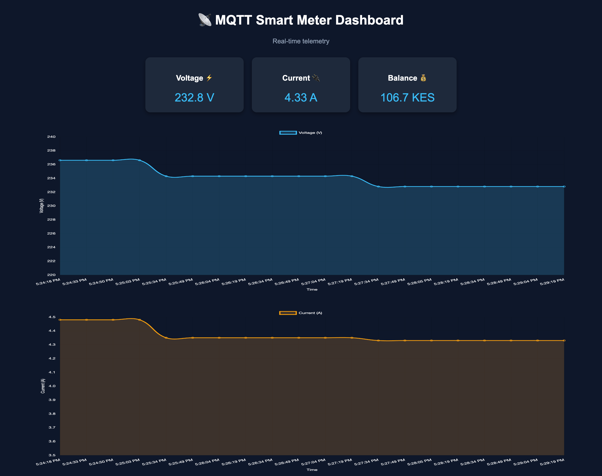

# 📡 MQTT Smart Meter Dashboard

A real-time IoT dashboard that visualizes smart meter telemetry using MQTT, Node.js, and Chart.js.

---

## 🚀 Features

- 📡 Real-time data streaming via MQTT  
- ⚡ Live updating dashboard (no page refresh)  
- 📊 Voltage and current visualization using charts  
- 💰 Balance monitoring  
- 🎨 Clean and responsive UI  

---

## 🖼️ Preview



---

## 🧠 How It Works

1. The application connects to an MQTT broker  
   `mqtt://byte-iot.net:1883`

2. It subscribes to:

/topic/#

3. Incoming smart meter data is parsed and processed

4. Data is sent to the frontend using **WebSockets (Socket.IO)**

5. The dashboard updates in real-time:
- Cards (Voltage, Current, Balance)
- Charts (live trends)

---

## 📊 Metrics Displayed

| Metric   | Description                  |
|---------|------------------------------|
| Voltage | Electrical supply level (V)  |
| Current | Power consumption (A)        |
| Balance | Remaining prepaid energy (KES)|

---

## 🛠️ Tech Stack

- Node.js
- Express.js
- MQTT.js
- Socket.IO
- Chart.js

---

## ▶️ Run Locally

```bash
npm install
node app.js

Open in browser:

http://localhost:3000
